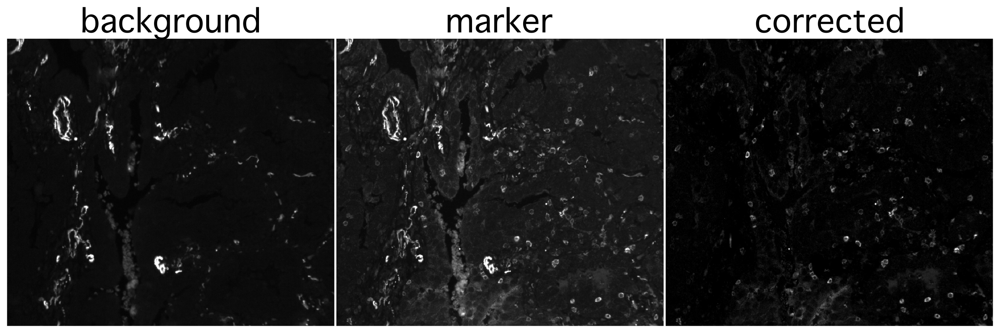

# Backsub - pixel-by-pixel channel subtraction tool for multiplexed immunofluorescence data

Backsub performs pixel-by-pixel background subtraction between marker and background channels scaled by their respective exposure times. The outputs are saved as pyramidal OME-TIFF files. It was originally developed for data produced by the Lunaphore COMET platform and is fully compatible with the [MCMICRO](https://mcmicro.org) pipeline.


Example of pixel-wise autofluorescence subtraction with Backsub:
<p align="left">
  
</p>

## Introduction

In multiplexed immunofluorescence images, autofluorescence and background signals can cause improper cell segmentation, and can affect downstream intensity quantification which is why, if possible, they should be subtracted from raw channel intensities. The most precise way of subtracting background would be on a pixel-to-pixel basis. An alternative would be to subtract the background measurements from the marker measurements for each cell after quantification, however, for visual inspection of images, segmentation, and data presentation, it is preferred to use the corrected values.

The primary use case is autofluorescence subtraction for multichannel and multicycle microscopy images to improve:
* image visualization of tissues with strong autofluorescence
* segmentation accuracy
* quantification quality (if the previous two usecases are not necessary, downstream subtraction of autofluorescence signal is encouraged instead)

Background subtraction is performed using the following formula:

$Marker_{corrected} = Marker_{raw} - Background \times \frac{Exposure_{Marker}}{Exposure_{Background}}$

## Installation

Backsub can be run either in a preconfigured Docker container or in a local conda environment.

### Option 1: Docker

Pull the latest container from the GitHub Container Registry:
```
docker pull ghcr.io/schapirolabor/background_subtraction:latest
```
You can then run Backsub directly, mounting your input and output directories:
```
docker run --rm -v $(pwd):/data ghcr.io/schapirolabor/background_subtraction:latest \
    python background_sub.py \
    -r /data/input_image.tif \
    -o /data/corrected_image.ome.tif \
    -m /data/markers.csv \
    -mo /data/markers_corrected.csv
```
Note that all required dependencies are already included inside the container.

If you want to build the container yourself, clone the repository first, then build it from the provided Dockerfile:
```
git clone https://github.com/SchapiroLabor/Background_subtraction.git
cd Background_subtraction
docker build -t background_subtraction:latest .
```
### Option 2: Conda

Clone the repository and create the Conda environment:
```
git clone https://github.com/SchapiroLabor/Background_subtraction.git
cd Background_subtraction
conda env create -f environment.yml
conda activate backsub_env
```
You can now run Backsub locally (note that you need to point to the tool's script):
```
python backsub/background_sub.py -h
```

## Execution and usage

### Inputs

A `TIFF` or `OME-TIFF` file containing multiplexed immunofluorescence data.

A `markers.csv` file should be provided to describe the channels of the image. Needs to contain the following columns:

| Column      	| Description                                                                                                                                                                                                                                    	| Required 	|
|-------------	|------------------------------------------------------------------------------------------------------------------------------------------------------------------------------------------------------------------------------------------------	|----------	|
| marker_name 	| Contains the channel names, all values **must** be unique.                                                                                                                                                                                     	| yes      	|
| background  	| Specifies the channel that should be subtracted from the specified channel. The `background` value, if present, **must** match the `marker_name` value of the background channel. If no subtraction is necessary, the field can be left empty. 	| yes      	|
| exposure    	| Contains the exposure time used for channel acquisition in ms.                                                                                                                                                                                 	| yes      	|
| remove      	| Optional column that allows the user to exclude certain channels from the output file by setting that channel's `remove` value to `TRUE`.                                                                                                       	| no       	|

An exemplary [markers.csv](https://github.com/SchapiroLabor/Background_subtraction/blob/main/example/markers.csv) file is provided.

### Command Line Interface

| Argument 	| Long form          	| Description                                                                                                                                                                                                                                                         	| Specification                                                	| Default 	| Required 	|
|----------	|--------------------	|---------------------------------------------------------------------------------------------------------------------------------------------------------------------------------------------------------------------------------------------------------------------	|--------------------------------------------------------------	|---------	|----------	|
| -in      	| --input            	| File path to the input image file.                                                                                                                                                                                                                                  	| string, ends with `.tif`, `.tiff`, `.ome.tif` or `.ome.tiff` 	|         	| yes      	|
| -o       	| --output           	| File path where the output pyramidal OME-TIFF will be saved.                                                                                                                                                                                                        	| string, ends with `.ome.tif` or `.ome.tiff`                  	|         	| yes      	|
| -m       	| --markers          	| File path to the markers (CSV) file containing the list of marker names and their respective background channels.                                                                                                                                                   	| string, ends with `.csv`                                     	|         	| yes      	|
| -mo      	| --marker-output        	| File path where the output marker (CSV) file matching the output image will be saved.                                                                                                                                                                               	| string, ends with `.csv`                                     	|         	| yes      	|
| -mpp     	| --pixel-size       	| Pixel size provided in microns (microns per pixel). If not provided, image metadata will be checked. If that is not successful, the value will be set to 1.                                                                                                         	| float                                                        	| None    	| no       	|
| -sr      	| --save-ram         	| Optional flag to approximately cut RAM usage in half. Note that the dimensions of the reduced resolution levels (sub-levels) of the output pyramidal image will slightly differ whether or not the argument is used.                                                	| boolean flag                                                 	| false   	| no       	|
| -comp    	| --compression      	| The output pyramidal OME-TIFF will be compressed using the specified compression. Set to "none" for no compression.                                                                                                                                                 	| string, either "lzw", "zlib", or "none"                      	| "lzw"   	| no       	|
| -ts      	| --tile-size        	| Tile size used for writing pyramidal outputs. Note that the file size is smaller for smaller tile size values.                                                                                                                                                      	| integer, multiple of 16                                      	| 256     	| no       	|
| -dsf     	| --downscale-factor 	| Downscale factor for pyramid layer creation. This value will only be used if the input image is NOT pyramidal. If the input image is pyramidal, the number of levels in the output image will be the same as in the input so the downscale factor won't be applied. 	| integer, larger than 1                                       	| 2       	| no       	|
| -v       	| --version          	| Prints Backsub version.                                                                                                                                                                                                                                             	|                                                              	|         	|          	|

Example of a full command (note to provide full paths where applicable):
```
python Background_subtraction/backsub/background_sub.py \
    --input /data/input_image.tif \
    --output /data/corrected_image.ome.tif \
    --markers /data/markers.csv \
    --marker-output /data/markers_corrected.csv \
    --pixel-size 0.65 \
    --tile-size 256 \
    --downscale-factor 2 \
    --compression zlib
```

### Outputs

The output image file will be a pyramidal `OME-TIFF` file containing the processed channels. The channels tagged for removal will be excluded from the final image.

The output markers file will be a `CSV` file containing the following columns: "marker_name", "background", "exposure". The "marker_name" column will contain the marker names of the processed channels. The "background" column will contain the marker names of the channels used for subtraction. The "exposure" column will contain the exposure times of the processed channels. 

## Features

* Pixel-wise channel subtraction scaled by exposure time.
* Autofluroescence correction for multiplexed immunofluroescence images.
* Pyramidal OME-TIFF output compatible with the MCMICRO pipeline.
* Optional image compression to not bloat data size of large projects.
* Low-memory mode for local processing of large datasets.
* Automatic metadata extraction for Lunaphore COMET data.

## Contributing

Contributions are welcome! If you would like to contribute, please:
1. Fork the repository
2. Create a feature branch:
```
git checkout -b feature/my-feature
```
3. Commit your changes and open a pull request

For questions of issues, please open a GitHub issue.

## Contributors

Author and maintainer:
* [Krešimir Beštak](@kbestak)

Contributors: 
* [Victor Perez](@VictorDidier)
* [Florian Wünnemann](@FloWuenne).

## Changelog

See the [CHANGELOG](https://github.com/SchapiroLabor/Background_subtraction/blob/main/CHANGELOG.md) file for deatils about new features, bug fixes, and version history.

## License

This project is licensed under the terms of the [MIT License](https://github.com/SchapiroLabor/Background_subtraction/blob/main/LICENSE).

## Citation

If you use Backsub in your work, please cite it as:

> Bestak, K., Perez, V., & Wuennemann, F. (2025). Backsub: pixel-by-pixel channel subtraction tool for multiplexed immunofluorescence data.
